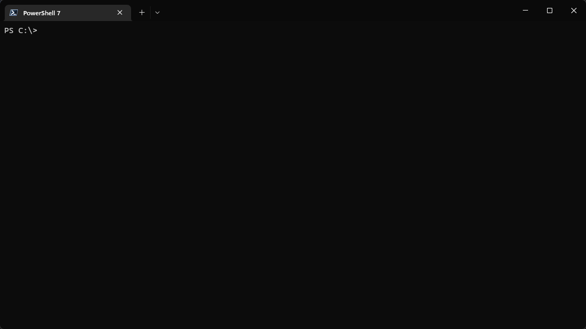

[](https://github.com/dhcgn/workplace-sync/actions/workflows/go.yml)

# workplace-sync
 
> Keep your tools in sync!

This tool (under heavy development) downloads files from a list of links. These links can be a DNS TXT record or a local *.json file.

So I need only this tool on every of my computers to access easy all my tools.

```
Workplace Sync 305705825cc917f8 2022-11-05T22:56:49Z go1.19.3
https://github.com/dhcgn/workplace-sync

host or localSource is required
  -all
        Download all links
  -host string
        The host which TXT record is set to an url of links
  -local string
        The local source of links
  -name string
        The name or preffix of the tool to download
```

## Demo



## Installation

1. Add DNS TXT record with a link to your JSON file or use my at ws.hdev.io

```json
{
    "links": [
        {
            "url": "https://download.sysinternals.com/files/SysinternalsSuite.zip",
            "version": "latest"
        },
                {
            "name": "zstd",
            "url": "https://github.com/facebook/zstd/releases/download/v1.5.2/zstd-v1.5.2-win64.zip",
            "decompress_flat": true,
            "decompress_filter": "\\.exe$",
            "version": "v1.5.2"
        }
    ]
}
```

## Usage

The folder `C:\ws\` will be created.

### Selected Download

```
workplace-sync.exe -host ws.hdev.io

Workplace Sync  
https://github.com/dhcgn/workplace-sync

 INFO  Got 12 links
 INFO  Use download folder C:\ws\
Please select file to download:
>
   SysinternalsSuite.zip                    
   winbox64                                 
   zstd-v1.5.2-win64.zip                    
   jxl                                      
   upx-4.0.0-win64.zip                      
   age-v1.0.0-windows-amd64.zip
```

### Download all files

```
workplace-sync.exe -host ws.hdev.io -all
```

### Future Features

- Integrity check all the files
- Change download location of single files 
- Use a optional config file
- Possiblility of using encrypted files (with https://age-encryption.org/)
- Secure DNS TXT requests
- Update only missing files
- Update only new files
- Allow mutliple DNS TXT records
- Install ps1 script
